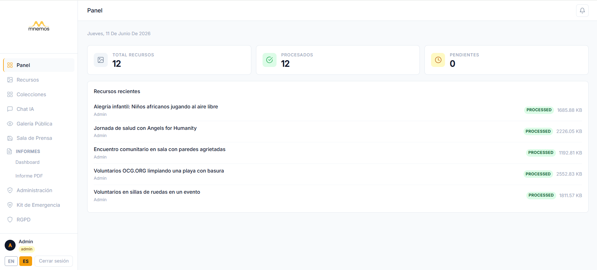
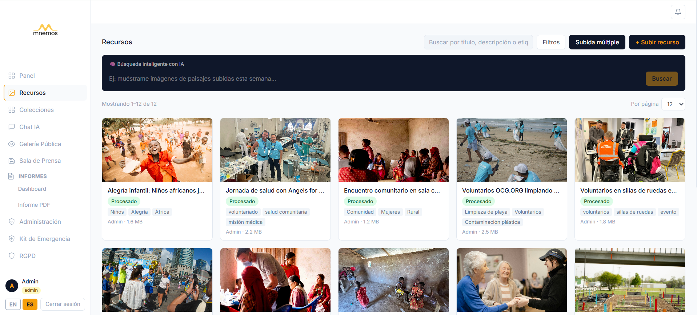
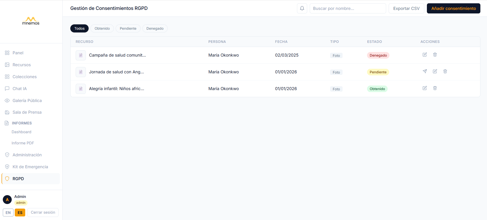
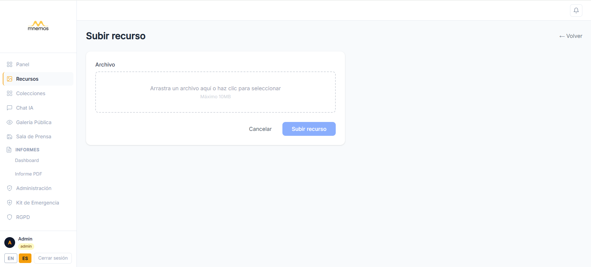
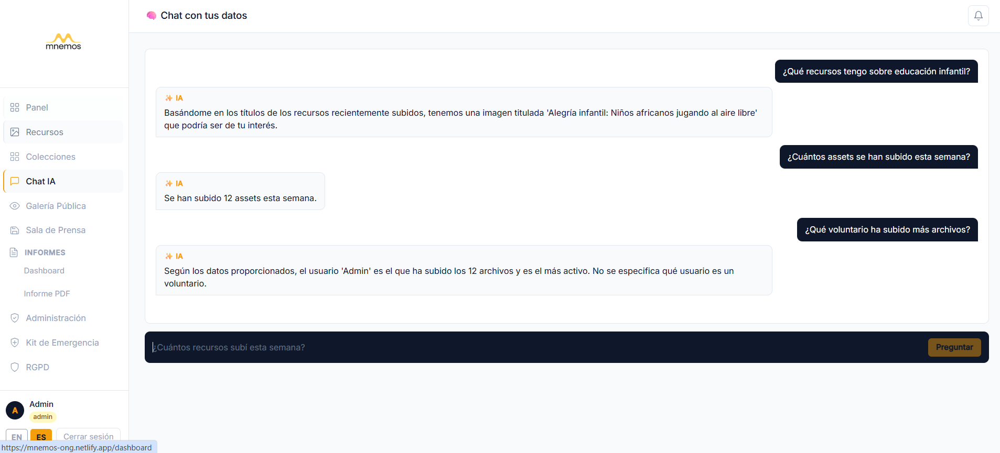
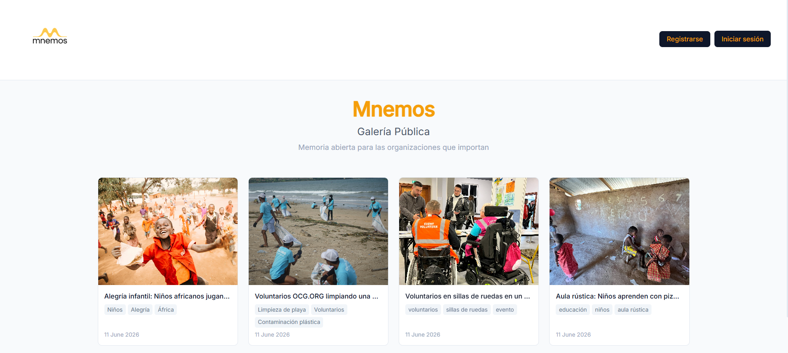
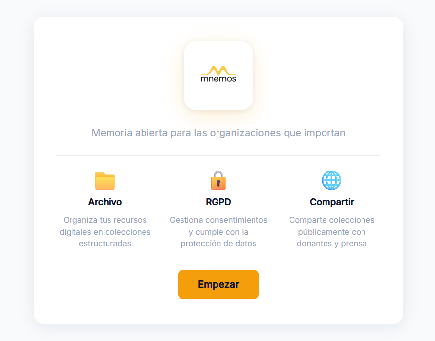
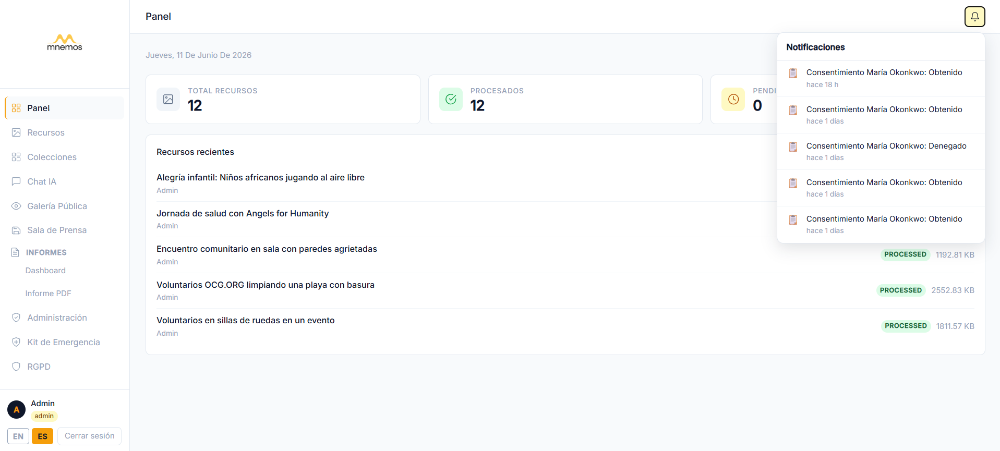
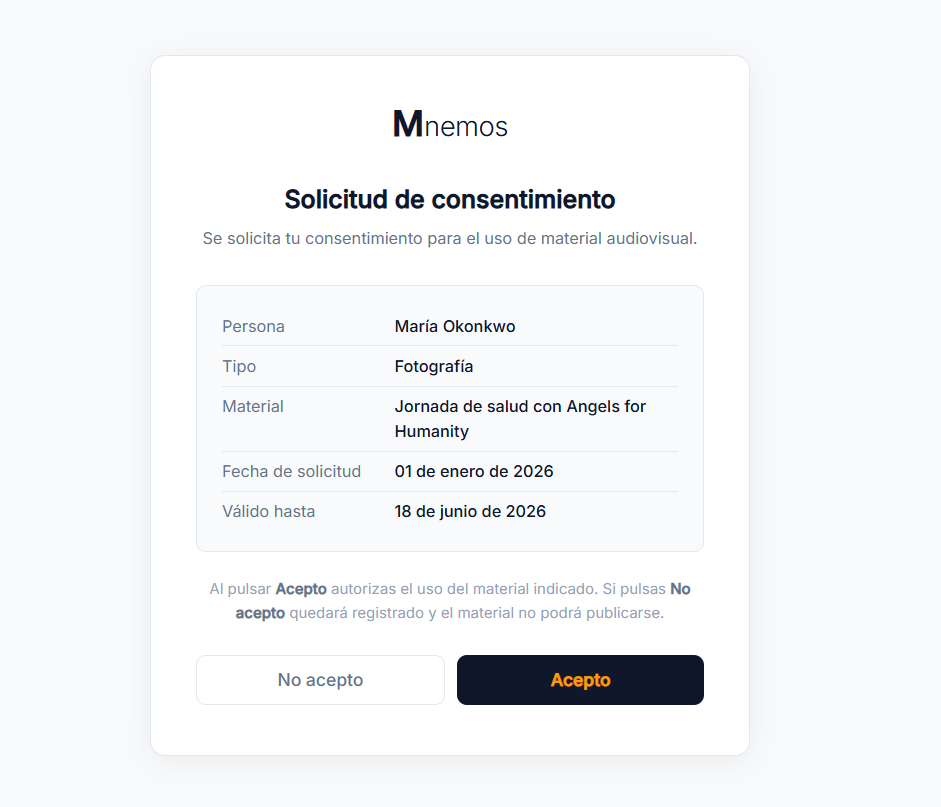

# Mnemos

### *Open memory for organizations that matter*

[](#running-the-tests)
[](LICENSE)
[](https://www.php.net/)
[](https://laravel.com/)
[](https://github.com/rubenesky/mnemos-frontend)
[](https://github.com/rubenesky/mnemos-backend)

---

Mnemos is a free, open-source digital archive system built for NGOs, cultural foundations, educational institutions, and community organizations. It gives your team a single, searchable home for all your photos, videos, and documents — with GDPR consent tracking and AI-powered accessibility built in.

---

## The Problem

Most organizations are losing their institutional memory right now, and they do not know it.

**1. No structured archive**
Photos, videos, and documents are scattered across WhatsApp groups, shared Google Drive folders, and email threads that span years. When someone asks *"do we have a photo from the 2019 campaign?"* the honest answer is usually *"somewhere, maybe."* There is no way to search, no consistent naming, and no single place to look.

**2. No consent tracking**
Organizations regularly publish images of volunteers, program participants, and minors — without any documented record that consent was obtained. Under GDPR, this is not just a procedural gap: it is legal exposure. When an audit or a complaint arrives, there is no paper trail to produce.

**3. Technical barrier**
Professional digital archive tools — Canto, Bynder, Brandfolder — cost thousands of euros per year and require a dedicated IT department to install, configure, and maintain. They are built for marketing teams at corporations, not for a team of five running after-school programs.

Mnemos removes all three barriers. It is free, installs in one command, and is designed to be used by people who are not technical.

---

## 🏛️ A Real Use Case

The Fundació Memòria Viva in Lleida has spent 20 years collecting photographs, oral histories, and handwritten documents from elderly residents — an irreplaceable record of mid-20th century rural life in Catalonia. For most of that time, those materials lived in cardboard boxes, external hard drives, and a shared Dropbox folder that nobody fully understood. Volunteers came and went; institutional knowledge walked out the door with them.

With Mnemos, the foundation ingests a digitized photograph, and the system automatically generates an accessible description of its contents via AI — a medieval farmhouse at dusk, three women sorting grain, a child watching from a doorway. That description makes the image findable by anyone searching "farmhouse" or "harvest" years later. Consent records for every living person pictured are tracked directly in the system, color-coded by status, and blocked from public publication until documented. A public gallery URL lets the foundation share curated collections with researchers and journalists without requiring any login. And when a new volunteer joins for the summer, they get a temporary Volunteer role that expires automatically the day they leave — no forgotten admin accounts, no manual cleanup.

This is what Mnemos is for.

---

## ✨ Features

**1. Public Gallery**
Share asset collections publicly without requiring a login. Each collection gets its own shareable URL. Ideal for sharing press kits, exhibitions, or open archives with the outside world.

**2. 🔒 GDPR Consent Panel**
Track consent status per asset with a color-coded dashboard: obtained (green), pending (yellow), denied (red). Assets without documented consent are automatically blocked from public publication. Audit-ready at any time.

**3. 🚀 Zero-tech Install**
One command gets you running: `./install.sh`. No server configuration knowledge required. Docker handles everything. If you can open a terminal and paste a command, you can install Mnemos.

**4. AI Auto Alt-text**
Every image you upload automatically receives an accessibility description generated by Google Gemini Vision. This makes your archive screen-reader compatible and improves searchability — without any manual work.

**5. Volunteer Role**
A temporary access level between Viewer and Editor, with a configurable expiry date. Perfect for interns, short-term project volunteers, or students on placement. Access disappears automatically when the period ends.

**6. Multilingual**
Full Spanish and English support throughout the interface, powered by Laravel's i18n system. More languages can be added by the community.

**7. 🔗 Token-Based Consent Requests**
Generate a shareable link for any pending consent record and send it directly to the person whose consent is required. The recipient opens the link — no account needed — reviews the details, and accepts or denies in one click. The decision is recorded instantly and admins are notified automatically.

**8. 🔔 Internal Notification System**
Real-time bell icon in the topbar keeps admins informed without email. Notifications fire automatically when a volunteer uploads an asset or when someone responds to a consent request. Unread count badge, per-item mark-as-read, and "mark all read" — all persisted in the database.

**9. 🧭 Guided Onboarding**
A 3-step modal greets every new user on their first login, explaining what Mnemos does and how to get started. Shown once and never again (tracked in localStorage). No separate redirect or page — it appears directly over the dashboard.

---

## 📸 Screenshots

| Dashboard | Asset Gallery | GDPR Consent Panel |
|---|---|---|
|  |  |  |

| Asset Upload | AI Chat | Public Gallery |
|---|---|---|
|  |  |  |

| Onboarding Modal | Notification Bell | Consent Request Form |
|---|---|---|
|  |  |  |

---

## Tech Stack

| Layer | Technology |
|---|---|
| Backend | PHP 8.2 / Laravel 10 |
| Database | MySQL 8 |
| API Authentication | Laravel Sanctum |
| Asset Storage and CDN | Cloudinary |
| AI (metadata, alt-text, search, chat) | Google Gemini |
| Deployment | Docker Compose (optional) |
| Tests | Pest 2.x |

---

## Installation

### Quick start with Docker (recommended)

No prior technical knowledge required. You need Docker Desktop installed — [download it here](https://www.docker.com/products/docker-desktop/) — and then run:

```bash
git clone https://github.com/rubenesky/mnemos-backend
cd mnemos-backend
chmod +x install.sh
./install.sh
```

The install script sets up the database, generates your application key, and starts all services automatically. Your Mnemos instance will be available at `http://localhost:8000`.

### Manual install

If you prefer to run Mnemos without Docker, you will need PHP 8.2+, Composer, and MySQL installed on your machine.

```bash
composer install
cp .env.example .env
php artisan key:generate
php artisan migrate --seed
php artisan serve
```

### Environment variables

Copy `.env.example` to `.env` and fill in the following values:

```env
# Application
APP_NAME=Mnemos
APP_URL=http://localhost:8000          # The URL where Mnemos will be accessible

# Database — your MySQL connection details
DB_DATABASE=mnemos                     # The name of the database to create
DB_USERNAME=root                       # Your MySQL username
DB_PASSWORD=                           # Your MySQL password (leave blank if none)

# Cloudinary — free account at cloudinary.com
# All uploaded files are stored here
CLOUDINARY_CLOUD_NAME=your_cloud_name
CLOUDINARY_API_KEY=your_api_key
CLOUDINARY_API_SECRET=your_api_secret

# Google Gemini — free API key at aistudio.google.com
# Powers alt-text generation, natural language search, and AI chat
GEMINI_API_KEY=your_gemini_api_key
```

**Where to get the keys:**
- Cloudinary: Create a free account at [cloudinary.com](https://cloudinary.com). Your credentials are on the Dashboard page.
- Gemini API: Get a free key at [aistudio.google.com](https://aistudio.google.com). No billing required for standard usage.

---

## API Overview

Mnemos exposes a REST API authenticated with Bearer tokens (Laravel Sanctum). All requests require an `Authorization: Bearer <token>` header except where noted.

| Method | Endpoint | Auth | Description |
|--------|----------|------|-------------|
| POST | `/api/login` | No | Obtain an access token |
| POST | `/api/logout` | Yes | Invalidate current token |
| GET | `/api/assets` | Yes | List all assets (paginated) |
| POST | `/api/assets` | Yes | Upload a new asset |
| GET | `/api/assets/{id}` | Yes | Retrieve a single asset |
| PATCH | `/api/assets/{id}` | Yes | Update asset metadata |
| DELETE | `/api/assets/{id}` | Yes | Delete an asset |
| GET | `/api/assets/{id}/status` | Yes | Poll AI processing status |
| POST | `/api/search` | Yes | Natural language search |
| POST | `/api/rag` | Yes | AI chat over your archive |
| GET | `/api/public/gallery` | No | Public gallery (no login) |
| GET | `/api/consents` | Yes | List consent records |
| POST | `/api/consents` | Yes | Create a consent record |
| PATCH | `/api/consents/{id}` | Yes | Update consent status |
| DELETE | `/api/consents/{id}` | Yes | Remove a consent record |
| POST | `/api/consents/{id}/send-request` | Yes | Generate a shareable consent request link |
| GET | `/api/public/consents/{token}` | No | View consent form by token |
| POST | `/api/public/consents/{token}` | No | Submit consent decision by token |
| GET | `/api/notifications` | Yes | List notifications for current user |
| POST | `/api/notifications/{id}/read` | Yes | Mark a notification as read |
| POST | `/api/notifications/read-all` | Yes | Mark all notifications as read |

**Login example:**

```bash
curl -X POST https://your-instance.com/api/login \
  -H "Content-Type: application/json" \
  -d '{"email": "admin@example.com", "password": "your-password"}'
```

**Natural language search example:**

```bash
curl -X POST https://your-instance.com/api/search \
  -H "Authorization: Bearer your-token" \
  -H "Content-Type: application/json" \
  -d '{"query": "photos from the 2023 summer campaign"}'
```

---

## Roadmap

The following features are planned for future releases. Contributions are welcome.

- [ ] Social media scheduling integration (publish directly to Instagram, LinkedIn)
- [ ] Bulk import from Google Drive and Dropbox
- [ ] White-label theming — custom logo, colors, and domain per organization
- [ ] Self-hosted email notifications for consent requests and uploads
- [ ] Mobile app (React Native) for field teams

Have a feature request? Open an issue and describe your use case.

---

## Contributing

Mnemos is open source and welcomes contributions from developers, translators, and organizations willing to test and give feedback.

**Reporting issues**
Use [GitHub Issues](https://github.com/rubenesky/mnemos-backend/issues). Please include: what you expected to happen, what actually happened, and your environment (PHP version, OS, how you installed).

**Submitting a pull request**
1. Fork the repository
2. Create a branch: `git checkout -b feature/your-feature-name`
3. Make your changes
4. Run the test suite: `./vendor/bin/pest`
5. Open a PR against `main` with a clear description of what changes and why

**Code standards**
- PSR-12 formatting (enforced by Laravel Pint: `./vendor/bin/pint`)
- PHPDoc blocks on all public methods
- New features must include tests
- Commit messages follow Conventional Commits (`feat:`, `fix:`, `docs:`, etc.)

**Running the tests:**

```bash
./vendor/bin/pest
```

The test suite currently covers **90 tests / 204+ assertions** across authorization, security, IDOR, asset CRUD, consent tokens, notifications, and AI processing.

---

## Sustainability

Mnemos is and will remain free and open source under the MIT license. To support ongoing development, the following paid services are available for organizations that want professional assistance:

- **Hosted installation and setup** — we install and configure Mnemos on your server or cloud account
- **Custom training** — hands-on sessions for your team, in Spanish or English
- **Dedicated support plans** — priority email support with guaranteed response times
- **Custom feature development** — specific features built for your organization's workflow

For inquiries: [dcrubben25@gmail.com](mailto:dcrubben25@gmail.com)

---

## License

Mnemos is released under the [MIT License](LICENSE). You are free to use, modify, and distribute it for any purpose, including commercial use. Attribution is appreciated but not required.
