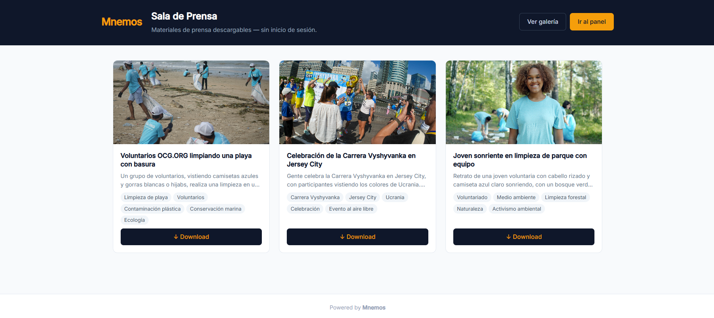
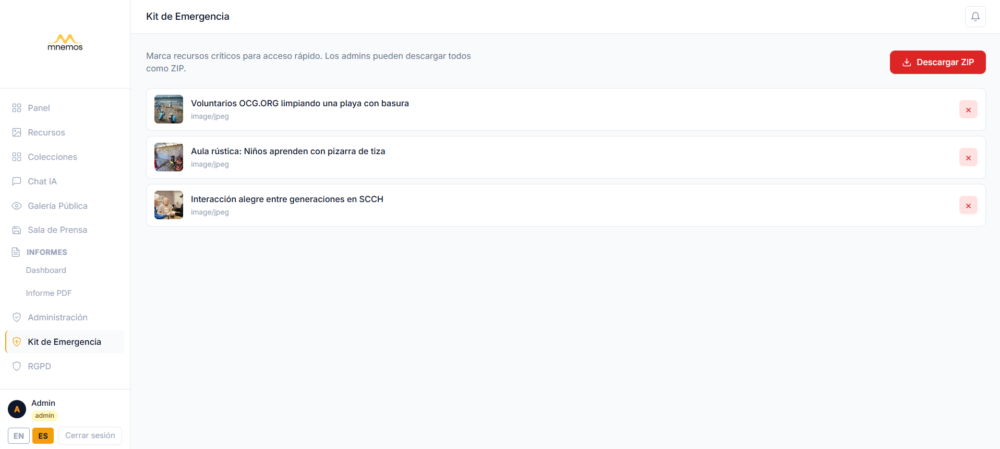
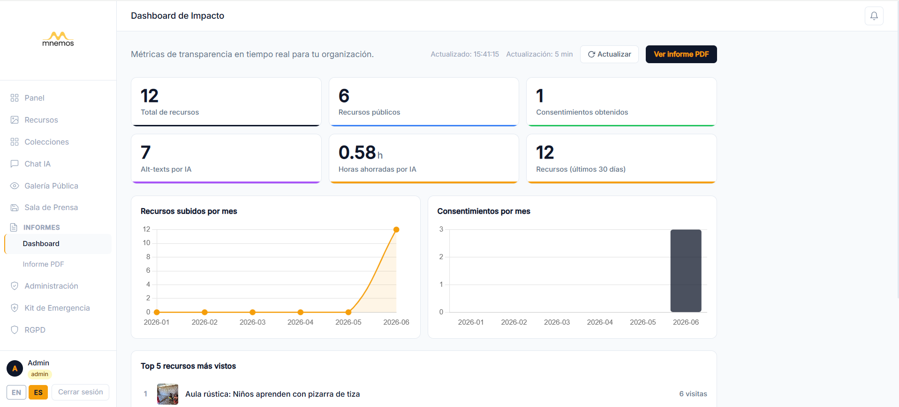
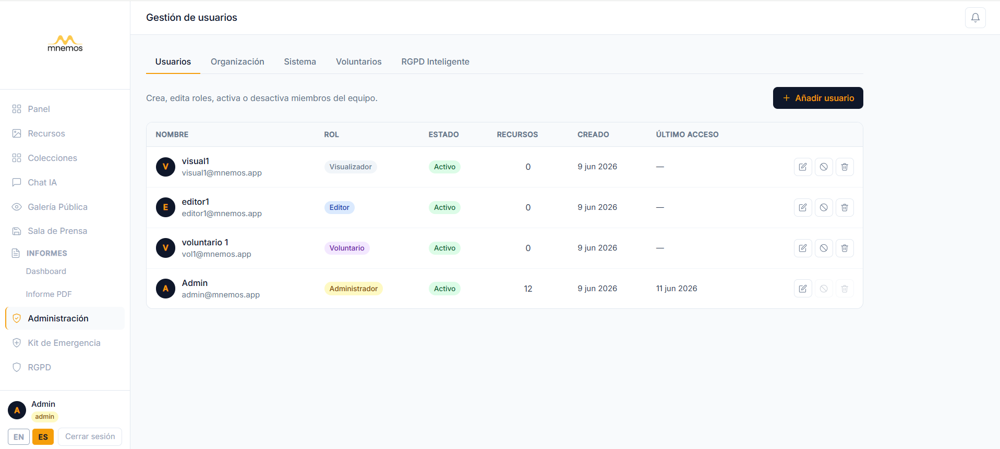

# Mnemos

### *Open memory for organizations that matter*

🇬🇧 English | 🇪🇸 [Español](README.es.md)

[](#running-the-tests)
[](LICENSE)
[](https://www.php.net/)
[](https://laravel.com/)
[](https://github.com/rubenesky/mnemos-frontend)
[](https://github.com/rubenesky/mnemos-backend)

---

Mnemos is a free, open-source digital archive system built for NGOs, cultural foundations, educational centres, and community organizations. It gives your team a single, searchable space for all your photos, videos, and documents — with GDPR consent tracking and AI-powered accessibility built in from the start.

---

## The Problem

Most organizations are losing their institutional memory right now — and they don't know it.

**1. No structured archive**
Photos, videos, and documents are scattered across WhatsApp groups, shared Google Drive folders, and email threads spanning years. When someone asks *"do we have any photos from the 2019 campaign?"*, the honest answer is usually *"somewhere, maybe"*. There's no way to search, no consistent naming convention, and no single place to look.

**2. No consent records**
Organizations regularly publish images of volunteers, programme participants, and minors — without any documented record that consent was obtained. Under GDPR, this isn't just a procedural gap: it's legal exposure. When an audit or complaint arrives, there's no paper trail to present.

**3. Technical barrier**
Professional digital archive tools — Canto, Bynder, Brandfolder — cost thousands of euros per year and require a dedicated IT department to install, configure, and maintain. They're designed for marketing teams in large corporations, not for a team of five managing after-school programmes.

Mnemos removes all three barriers. It's free, installs with a single command, and is designed to be used by people without a technical background.

---

## 🏛️ A Real Use Case

The Fundació Memòria Viva de Lleida has spent 20 years collecting photographs, oral histories, and handwritten documents from elderly residents — an irreplaceable record of rural Catalan life in the mid-twentieth century. For most of that time, those materials lived in cardboard boxes, external hard drives, and a shared Dropbox folder nobody fully understood. Volunteers came and went; institutional knowledge left with them.

With Mnemos, the foundation ingests a digitised photograph and the system automatically generates an accessible description of its content using AI — a medieval farmhouse at dusk, three women sorting grain, a child watching from a doorway. That description makes the image findable by anyone searching for "farmhouse" or "harvest" years later. The consent records for every living person photographed are managed directly in the system, colour-coded by status, and locked from public publication until documented. A public gallery URL lets the foundation share curated collections with researchers and journalists with no login required. And when a new summer volunteer joins, they receive a temporary Volunteer role that expires automatically on the day they leave — no forgotten admin accounts, no manual cleanup.

This is what Mnemos is for.

---

## ✨ Features

**1. Public Gallery**
Share collections of resources publicly without requiring a login. Each collection has its own shareable URL. Ideal for sharing press kits, exhibitions, or open archives with the outside world.

**2. 🔒 GDPR Consent Panel**
Track consent status per resource with a colour-coded dashboard: obtained (green), pending (yellow), denied (red). Resources without documented consent are automatically locked from public publication. Audit-ready at any time.

**3. 🚀 Zero-knowledge installation**
A single command gets you started: `./install.sh`. No server configuration knowledge required. Docker handles everything. If you can open a terminal and paste a command, you can install Mnemos.

**4. Automatic AI alt-text**
Every image you upload automatically receives an accessibility description generated by Google Gemini Vision. This makes your archive compatible with screen readers and improves searchability — with no manual work.

**5. Volunteer Role**
A temporary access tier between Viewer and Editor, with a configurable expiry date. Perfect for interns, short-term project volunteers, or students on placement. Access disappears automatically when the period ends.

**6. Multilingual**
Full support for Spanish and English throughout the interface, powered by Laravel's i18n system. The community can add more languages.

**7. 🔗 Token-based Consent Requests**
Generate a shareable link for any pending consent record and send it directly to the person whose consent is required. The recipient opens the link — no account needed — reviews the details, and accepts or denies with one click. The decision is recorded instantly and administrators are notified automatically.

**8. 🔔 Internal Notification System**
A real-time bell icon in the top bar keeps administrators informed without email. Notifications fire automatically when a volunteer uploads a resource or when someone responds to a consent request. Unread counter, per-item marking, and "mark all as read" — all persisted in the database.

**9. 🧭 Guided Onboarding**
A 3-step modal greets every new user on their first login, explaining what Mnemos does and how to get started. Shown once and never again (tracked in localStorage). No redirect or separate page — it appears directly over the dashboard.

---

## 📸 Screenshots

| Dashboard | Asset Gallery | Public Gallery |
|---|---|---|
|  |  |  |

| GDPR Consent Panel | AI Chat | Press Room |
|---|---|---|
|  |  |  |

| Asset Upload | Emergency Kit | Impact Dashboard |
|---|---|---|
|  |  |  |

| Admin Panel | Notification Bell | Consent Form |
|---|---|---|
|  |  |  |

| Welcome Modal |
|:---:|
|  |

---

## Tech Stack

| Layer | Technology |
|---|---|
| Backend | PHP 8.2 / Laravel 10 |
| Database | MySQL 8 |
| API Authentication | Laravel Sanctum |
| Asset storage & CDN | Cloudinary |
| AI (metadata, alt-text, search, chat) | Google Gemini |
| Deployment | Docker Compose (optional) |
| Tests | Pest 2.x |

---

## Installation

### Quick start with Docker (recommended)

No prior technical knowledge required. You need Docker Desktop installed — [download it here](https://www.docker.com/products/docker-desktop/) — then run:

```bash
git clone https://github.com/rubenesky/mnemos-backend
cd mnemos-backend
chmod +x install.sh
./install.sh
```

The install script sets up the database, generates the application key, and starts all services automatically. Your Mnemos instance will be available at `http://localhost:8000`.

### Manual installation

If you prefer to run Mnemos without Docker, you'll need PHP 8.2+, Composer, and MySQL installed on your machine.

```bash
composer install
cp .env.example .env
php artisan key:generate
php artisan migrate --seed
php artisan serve
```

### Environment variables

Copy `.env.example` to `.env` and fill in the following values:

```env
# Application
APP_NAME=Mnemos
APP_URL=http://localhost:8000          # URL where Mnemos will be accessible

# Database — your MySQL connection details
DB_DATABASE=mnemos                     # Name of the database to create
DB_USERNAME=root                       # Your MySQL username
DB_PASSWORD=                           # Your MySQL password (leave blank if none)

# Cloudinary — free account at cloudinary.com
# All uploaded files are stored here
CLOUDINARY_CLOUD_NAME=your_cloud_name
CLOUDINARY_API_KEY=your_api_key
CLOUDINARY_API_SECRET=your_api_secret

# Google Gemini — free API key at aistudio.google.com
# Powers alt-text generation, natural language search, and AI chat
GEMINI_API_KEY=your_gemini_api_key
```

**Where to get the keys:**
- Cloudinary: Create a free account at [cloudinary.com](https://cloudinary.com). Your credentials are on the Dashboard page.
- Gemini API: Get a free key at [aistudio.google.com](https://aistudio.google.com). No credit card required for standard usage.

---

## Docker (desarrollo local)

Este repo incluye un `docker-compose.yml` que levanta una base de datos PostgreSQL local para desarrollo (la base de datos de producción sigue siendo Supabase y no se ve afectada por esto).

**Requisito:** [Docker Desktop](https://www.docker.com/products/docker-desktop/) instalado.

**Levantar la base de datos:**

```bash
docker compose up -d db
```

**Parar el contenedor:**

```bash
docker compose down
```

**Usar `.env.docker` para desarrollo local:**

`.env.docker` contiene la configuración de conexión apuntando al contenedor (`DB_HOST=db`, `DB_CONNECTION=pgsql`, etc.). Para usarlo en lugar de tu `.env` habitual, cópialo y genera la `APP_KEY`:

```bash
cp .env.docker .env
php artisan key:generate
```

---

## API Overview

Mnemos exposes a REST API authenticated with Bearer tokens (Laravel Sanctum). All requests require an `Authorization: Bearer <token>` header unless otherwise noted.

| Method | Endpoint | Auth | Description |
|--------|----------|------|-------------|
| POST | `/api/login` | No | Obtain an access token |
| POST | `/api/logout` | Yes | Invalidate the current token |
| GET | `/api/assets` | Yes | List all resources (paginated) |
| POST | `/api/assets` | Yes | Upload a new resource |
| GET | `/api/assets/{id}` | Yes | Retrieve a specific resource |
| PATCH | `/api/assets/{id}` | Yes | Update resource metadata |
| DELETE | `/api/assets/{id}` | Yes | Delete a resource |
| GET | `/api/assets/{id}/status` | Yes | Poll AI processing status |
| POST | `/api/search` | Yes | Natural language search |
| POST | `/api/rag` | Yes | AI chat over your archive |
| GET | `/api/health` | No | Health check — returns `{"ok":true}`, no DB query |
| GET | `/api/public/assets` | No | Public asset list, paginated (no login) |
| GET | `/api/public/gallery` | No | Public gallery (no login) |
| GET | `/api/consents` | Yes | List consent records |
| POST | `/api/consents` | Yes | Create a consent record |
| PATCH | `/api/consents/{id}` | Yes | Update consent status |
| DELETE | `/api/consents/{id}` | Yes | Delete a consent record |
| POST | `/api/consents/{id}/send-request` | Yes | Generate a consent request link |
| GET | `/api/public/consents/{token}` | No | View consent form by token |
| POST | `/api/public/consents/{token}` | No | Submit consent decision by token |
| GET | `/api/notifications` | Yes | List notifications for the current user |
| POST | `/api/notifications/{id}/read` | Yes | Mark a notification as read |
| POST | `/api/notifications/read-all` | Yes | Mark all notifications as read |

**Login example:**

```bash
curl -X POST https://your-instance.com/api/login \
  -H "Content-Type: application/json" \
  -d '{"email": "admin@example.com", "password": "your-password"}'
```

**Natural language search example:**

```bash
curl -X POST https://your-instance.com/api/search \
  -H "Authorization: Bearer your-token" \
  -H "Content-Type: application/json" \
  -d '{"query": "photos from the 2023 summer campaign"}'
```

---

## Keeping the service alive on Render (free tier)

Render's free tier stops services after 15 minutes of inactivity. The first request after a stop triggers a cold start of ~30 seconds, making the application appear broken to real users.

The fix is a free external service that pings the backend every 5 minutes, preventing shutdown entirely.

### Option 1 — UptimeRobot (recommended, free)

1. Create a free account at [uptimerobot.com](https://uptimerobot.com)
2. Click **+ Add New Monitor**
3. Fill in:
   - **Monitor Type**: `HTTP(s)`
   - **Friendly Name**: `Mnemos Backend`
   - **URL**: `https://mnemos-backend-if2n.onrender.com/api/health`
   - **Monitoring Interval**: `5 minutes`
4. Click **Create Monitor**

UptimeRobot will ping `/api/health` every 5 minutes. The endpoint returns `{"ok": true}` instantly without querying the database, so there's no cost to pinging it frequently. As a bonus, UptimeRobot will send you an email alert if the service goes down.

### Option 2 — cron-job.org (alternative, also free)

1. Create a free account at [cron-job.org](https://cron-job.org)
2. Create a new cron job:
   - **URL**: `https://mnemos-backend-if2n.onrender.com/api/health`
   - **Schedule**: every 14 minutes (`*/14 * * * *`)
3. Save

### Health endpoint

```
GET /api/health
→ 200 {"ok": true}
```

No authentication. No database query. Safe to ping at any interval.

---

## Roadmap

The following features are planned for future versions. Contributions are welcome.

- [ ] Social media scheduling integration (post directly to Instagram, LinkedIn)
- [ ] Bulk import from Google Drive and Dropbox
- [ ] Brand customisation — custom logo, colours, and domain per organisation
- [ ] Locally-hosted email notifications for consent requests and uploads
- [ ] Mobile app (React Native) for field teams

Have a feature request? Open an issue and describe your use case.

---

## Contributing

Mnemos is open source and welcomes contributions from developers, translators, and organisations willing to test and provide feedback.

**Reporting issues**
Use [GitHub Issues](https://github.com/rubenesky/mnemos-backend/issues). Please include: what you expected to happen, what actually happened, and your environment (PHP version, OS, installation method).

**Submitting a pull request**
1. Fork the repository
2. Create a branch: `git checkout -b feature/your-feature-name`
3. Make your changes
4. Run the tests: `./vendor/bin/pest`
5. Open a PR against `main` with a clear description of what changes and why

**Code standards**
- PSR-12 formatting (enforced by Laravel Pint: `./vendor/bin/pint`)
- PHPDoc blocks on all public methods
- New features must include tests
- Commit messages follow Conventional Commits (`feat:`, `fix:`, `docs:`, etc.)

**Running the tests:**

```bash
./vendor/bin/pest
```

<<<<<<< HEAD
La suite de tests cubre actualmente **291 tests / 790 assertions** en autorización, seguridad, IDOR, CRUD de recursos, tokens de consentimiento, notificaciones y procesamiento IA.
=======
The test suite currently covers **291 tests / 790 assertions** across authorisation, security, IDOR, asset CRUD, consent tokens, notifications, and AI processing.
>>>>>>> 8e74d97 (docs: add English README and Spanish translation, update test counts)

---

## Sustainability

Mnemos is and will remain free and open source under the MIT licence. To support continued development, the following paid services are available for organisations that want professional assistance:

- **Hosted installation and setup** — we install and configure Mnemos on your server or cloud account
- **Custom training** — hands-on sessions for your team, in Spanish or English
- **Dedicated support plans** — priority email support with guaranteed response times
- **Custom feature development** — specific features built for your organisation's workflow

For enquiries: [dcrubben25@gmail.com](mailto:dcrubben25@gmail.com)

---

## Licence

Mnemos is released under the [MIT Licence](LICENSE). You are free to use, modify, and distribute it for any purpose, including commercial use. Attribution is appreciated but not required.
